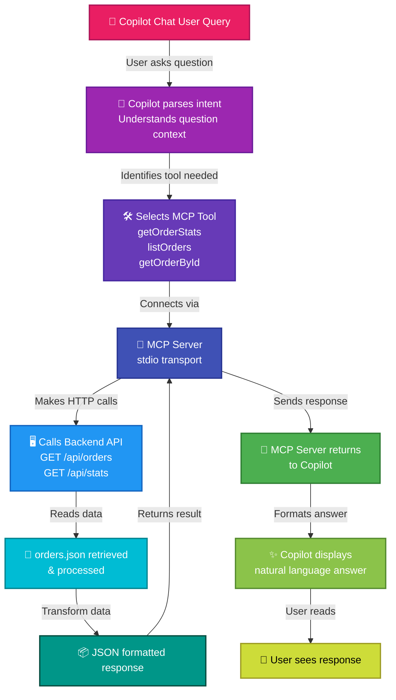

# MCP + GitHub Copilot Integration Flow

## 🎯 Interactive Diagram



## 📋 Flow Steps

| # | Component | Action |
|---|-----------|--------|
| 1 | 💬 Copilot Chat | User asks a question about orders |
| 2 | 🤖 Copilot Parser | Copilot analyzes intent and context |
| 3 | 🛠️ Tool Selection | Selects appropriate MCP tool: `getOrderStats`, `listOrders`, or `getOrderById` |
| 4 | 📡 MCP Server | Connects via stdio transport to MCP server |
| 5 | 🖥️ Backend API | Makes HTTP calls to Express backend endpoints |
| 6 | 📄 Data Retrieval | Reads and processes orders from `orders.json` |
| 7 | 📦 Format Response | Transforms data into JSON format |
| 8 | 🔄 Return to MCP | MCP server receives and returns response |
| 9 | ✨ Format Answer | Copilot formats response as natural language |
| 10 | 👤 User Sees Answer | User reads the formatted response in chat |

## 📊 Text Flow

```
Copilot Chat User Query
    ↓
Copilot parses intent
    ↓
Selects MCP Tool (getOrderStats, listOrders, getOrderById)
    ↓
MCP Server (stdio transport)
    ↓
Calls Backend API HTTP endpoints
    ↓
orders.json retrieved & processed
    ↓
JSON formatted response
    ↓
MCP Server returns to Copilot
    ↓
Copilot displays natural language answer
```

## 🔑 MCP Tools Available

| Tool | Purpose | Example |
|------|---------|---------|
| `getOrderStats` | Get aggregate statistics | Total orders, pending count, revenue |
| `listOrders` | List orders with filters | Find orders by status, city, state |
| `getOrderById` | Get single order details | Fetch specific order information |