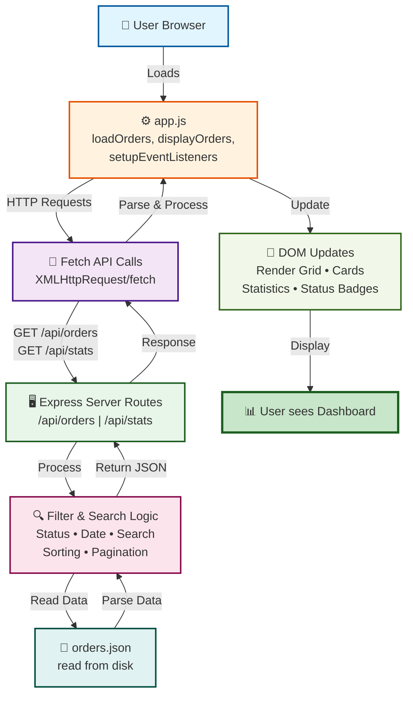

# E-Commerce Dashboard Flow

## 🎯 Interactive Diagram



## 📋 Flow Steps

| # | Component | Action |
|---|-----------|--------|
| 1 | 👤 User Browser | User loads the dashboard in browser |
| 2 | ⚙️ app.js | Frontend initializes: `loadOrders()`, `displayOrders()`, `setupEventListeners()` |
| 3 | 📡 Fetch API | Makes HTTP GET requests via `XMLHttpRequest` or `fetch()` |
| 4 | 🖥️ Express Routes | Backend processes requests on `/api/orders` and `/api/stats` |
| 5 | 🔍 Filter Logic | Applies filters, search terms, sorting, and pagination |
| 6 | 📄 orders.json | Reads and retrieves order data from disk |
| 7 | 📡 Response | Returns filtered JSON response back to frontend |
| 8 | 🎨 DOM Updates | Updates page elements: grid, cards, statistics |
| 9 | 📊 Dashboard | User sees complete dashboard with all orders ✓ |

## 📊 Text Flow

```
User Browser
    ↓
app.js (loadOrders, displayOrders, setupEventListeners)
    ↓
Fetch API Calls (XMLHttpRequest/fetch)
    ↓
Express Server Routes (/api/orders, /api/stats)
    ↓
Filter & Search Logic
    ↓
orders.json (read from disk)
    ↓
JSON Response back to Frontend
    ↓
DOM Updates → User sees Dashboard
```